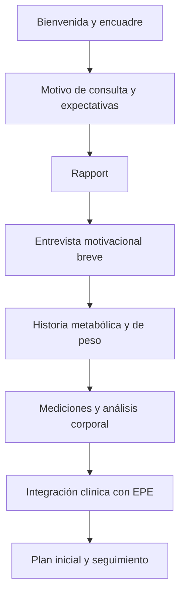

# Entrevista motivacional en práctica médica y su traducción a MetaboCare

> Estado: Guía clínica base
>
> Uso: Referencia para diseño de flujo y formatos clínicos en MetaboCore
> 
> Relacionado con: Conexión clínica, primera consulta, entrevista motivacional breve
> 
> No sustituye: juicio clínico, guías oficiales, valoración individual ni documentación normativa aplicable

---

## Resumen ejecutivo

La entrevista motivacional es, ante todo, un estilo clínico de comunicación: colaborativo, orientado a metas, atento al lenguaje de cambio y diseñado para fortalecer la motivación de la persona a partir de sus propias razones, dentro de una relación de aceptación y compasión. Sus elementos más sólidos y mejor establecidos son el “espíritu” de colaboración-evocación-aceptación-compasión, los cuatro procesos de enganchar, enfocar, evocar y planificar, y las microhabilidades OARS  - preguntas abiertas, afirmaciones, escucha reflexiva y resúmenes -  además del trabajo explícito con cambio vs. mantenimiento y con DARN-CAT.

En medicina, la utilidad más consistente de la entrevista motivacional no es “convencer” ni producir cambios inmediatos por simple persuasión. Su fortaleza está en mejorar la calidad de la conversación clínica, reducir discordia, aumentar exploración de ambivalencia, apoyar autonomía y favorecer motivación, intención y compromiso con pasos concretos. En atención primaria y obesidad, la evidencia accesible en esta revisión favorece verla como herramienta de relación terapéutica y activación del paciente, más que como tratamiento aislado capaz de asegurar por sí mismo grandes cambios ponderales o metabólicos.

Para obesidad y riesgo cardiometabólico, la recomendación más consistente de las guías no es “usar MI como moda”, sino hablar de peso y metabolismo sin estigma, pedir permiso, usar lenguaje centrado en la persona, reconocer la obesidad como enfermedad crónica heterogénea, explorar causas raíz y barreras, acordar metas realistas y sostener seguimiento longitudinal. En ese punto, la entrevista motivacional encaja muy bien porque ordena exactamente ese tipo de conversación.

La parte más débil de la evidencia, en cambio, es la pretensión de que la entrevista motivacional por sí sola produzca resultados robustos y uniformes en peso, HbA1c, presión arterial, lípidos o MAFLD. La literatura revisada muestra heterogeneidad de poblaciones, número de sesiones, fidelidad técnica, cointervenciones y desenlaces; además, en obesidad una revisión narrativa reciente subraya que muchos trabajos se han concentrado en pérdida de peso y han medido poco la experiencia del paciente o la reducción del estigma. En la práctica, esto favorece usar MI como capa transversal de comunicación combinada con nutrición, actividad física, sueño, farmacoterapia, educación y seguimiento, no como sustituto de ellos.

Traducido a MetaboCare, la entrevista motivacional debe colocarse dentro de Conexión clínica de la primera consulta, después de motivo de consulta/expectativas y rapport, y antes de la historia clínica extensa y de la discusión técnica del análisis corporal. En su versión operativa, debe ser breve, técnica, imprimible, guiada para el médico y nada burocrática. Debe capturar permiso, motivo personal de cambio, ambivalencia, confianza, barreras, recursos, lenguaje de cambio y un primer paso pequeño, realista y revisable. Ese enfoque es consistente con el marco de MetaboCare centrado en disregulación cardiometabólica y con MetaboCore como generador de formatos clínicos “paper-first”.

## Qué es la entrevista motivacional

La definición de referencia más utilizada hoy la describe como un estilo de comunicación colaborativo, orientado a metas y atento al lenguaje de cambio, diseñado para fortalecer la motivación personal y el compromiso con una meta específica mediante la evocación y exploración de las propias razones de la persona, en un ambiente de aceptación y compasión. MINT aclara además que no es una forma de “hacer que alguien cambie”, ni un paquete de trucos para imponerse en la conversación, sino una forma respetuosa de guiar entre escuchar y dirigir.

El “espíritu” de la entrevista motivacional puede resumirse en cuatro componentes. Colaboración significa alianza entre experto clínico y experto en su propia vida; evocación significa sacar razones y recursos del paciente en vez de depositarle sermones; aceptación implica respeto, empatía y autonomía; compasión significa priorizar el bienestar del paciente, no la agenda del profesional. Estas no son decoraciones éticas: son la base del método.

Los cuatro procesos son enganchar, enfocar, evocar y planificar. Enganchar crea una relación de trabajo; enfocar acuerda el tema de cambio; evocar construye el “por qué” del cambio desde la voz del paciente; planificar aborda el “cómo”, pero solo cuando ya hay suficiente disposición. SAMHSA enfatiza que precipitar la acción antes de explorar adecuadamente la disposición del paciente aumenta discordia y reduce eficacia.

Las habilidades nucleares son OARS: preguntas abiertas, afirmaciones, escucha reflexiva y resúmenes. MINT y SAMHSA coinciden en que estas habilidades sostienen la empatía, refuerzan fortalezas y hacen visible el significado de lo que el paciente dice. La escucha reflexiva no es repetir mecánicamente: es devolver comprensión y, a veces, una formulación más clara de la ambivalencia.

La entrevista motivacional trabaja muy de cerca con el lenguaje de cambio y el lenguaje de mantenimiento. SAMHSA resume el primero con DARN-CAT: deseo, capacidad, razones, necesidad, compromiso, activación y pasos dados. La tarea del clínico no es debatir con el lenguaje de mantenimiento, sino reconocerlo, no reforzarlo y ayudar al paciente a elaborar el lado del cambio. En el modelo actual de MI, la resistencia no se entiende como defecto estable del paciente, sino como una señal de que la interacción necesita ajuste.

La relación con autonomía, ambivalencia y adherencia es directa. La ambivalencia se considera normal; la autonomía se respeta en todo momento; y la adherencia deja de tratarse como obediencia para pasar a verse como una construcción compartida y sostenible. Por eso la MI es especialmente pertinente cuando el deseo, la importancia o la confianza son bajos, o cuando el paciente ha acumulado fracasos previos y llega con mezcla de esperanza, cansancio y defensa.

Este flujo es útil para MetaboCare porque recuerda que no conviene saltar del síntoma al plan sin pasar por permiso, significado personal y ambivalencia.

## Qué dice la evidencia en el contexto médico

La literatura de referencia revisada muestra que la entrevista motivacional se ha aplicado en múltiples contextos de salud y adherencia, en formatos individuales, grupales y también breves; MINT la presenta como un método de comunicación que puede usarse solo o combinado con otros abordajes. Sin embargo, esa amplitud de uso no significa que produzca el mismo tamaño de efecto en todos los escenarios. La evidencia global sobre MI es extensa, pero la evidencia específica por enfermedad cardiometabólica es claramente más heterogénea.

En consulta médica breve, lo más defendible con la evidencia accesible aquí es lo siguiente: sí hay espacio para microintervenciones de estilo MI, pero no existe un umbral universalmente validado de minutos que garantice eficacia. Lo que sí aparece con consistencia es que componentes concretos  - preguntar antes de aconsejar, explorar disposición, usar escalas, reflejar ambivalencia, acordar un paso pequeño -  caben dentro de visitas habituales y pueden modificar motivación e intención de cambio. Esa conclusión se apoya, sobre todo, en la naturaleza adaptable del método y en estudios de visitas reales donde la calidad del consejo se asoció con motivación e intención del paciente.

Un estudio en atención primaria con pacientes con obesidad encontró que, aunque 85% recibió consejería sobre obesidad, los médicos usaban en promedio solo 5.3 de 18 prácticas posibles del marco 5As. Aun así, cada práctica adicional se asoció con mayores probabilidades de que el paciente se sintiera motivado a perder peso y mostrara intención de comer mejor y ejercitarse. La centralidad en el paciente también se asoció positivamente con intención de cambio. Esto no demuestra por sí solo pérdida de peso ulterior, pero sí muestra que cómo se conversa importa clínicamente desde la propia visita.

La diferencia entre consejo tradicional, educación, entrevista motivacional y toma de decisiones compartida puede resumirse así. El consejo tradicional tiende a ser directivo; la educación se enfoca en información; la MI guía una exploración del significado, motivación y ambivalencia; y la toma de decisiones compartida organiza la elección entre opciones cuando ya existe un problema y varias alternativas razonables. En la práctica real suelen superponerse, pero MI aporta algo muy específico: evita que la fase educativa se convierta en imposición y prepara el terreno para decisiones compartidas más realistas.

Entre las técnicas más útiles para médicos de primer contacto destacan las escalas de importancia y confianza, porque convierten una conversación abstracta en algo explorable en menos de un minuto. SAMHSA describe el Importance Ruler y el Confidence Ruler como instrumentos para evocar “need talk” y “confidence talk”; también destaca que la autoeficacia es un predictor clave del cambio, y que revisar éxitos previos y preguntar qué subiría un punto la confianza ayuda más que insistir en la perfección.

La técnica Elicit-Provide-Elicit es especialmente útil en medicina porque permite dar información sin caer en una clase magistral. Primero se pregunta qué sabe el paciente y si quiere escuchar información; luego se ofrece información breve, neutral y en porciones pequeñas; finalmente se pregunta qué piensa o qué le hace esa información. Esa estructura es central para MetaboCare porque permite explicar glucosa, grasa visceral, hígado graso o fármacos sin activar defensa ni vergüenza.

## Qué dice la evidencia en obesidad y enfermedades cardiometabólicas

En obesidad, la base más firme de las guías actuales no es una defensa de MI como “tratamiento único”, sino la exigencia de una conversación clínica no estigmatizante, centrada en la persona y sostenida en seguimiento crónico. La guía canadiense de obesidad en adultos define la obesidad como enfermedad crónica compleja, progresiva y recidivante; subraya el peso del sesgo y del estigma; pide permiso antes de discutir obesidad; recomienda explorar causas raíz, barreras y complicaciones; y propone un plan largo, personalizado y sostenible. Todo esto es extraordinariamente compatible con entrevista motivacional.

La misma guía remarca que los clínicos no deben asumir que toda persona con obesidad está lista para iniciar tratamiento, que deben pedir permiso para hablar del tema, y que el éxito debe redefinirse más allá del peso corporal, hacia cambios de comportamiento saludables y resultados centrados en la salud. También propone el marco 5As: reconocer y pedir permiso, evaluar, discutir opciones, acordar metas de valor para la persona y sostener seguimiento.

Una revisión narrativa de 2025 sobre MI en obesidad llega a una conclusión clínicamente importante: los pacientes reportan altos niveles de prejuicio, estigma y discriminación en sistemas de salud; por tanto, los sistemas deben moverse hacia marcos de manejo de multimorbilidad con conversaciones centradas en la persona y no estigmatizantes. La revisión sostiene que la MI tiene potencial para transformar esas conversaciones, pero también señala una limitación crítica: la investigación en obesidad ha tendido a enfocarse casi exclusivamente en pérdida de peso, dejando menos estudiados desenlaces como experiencia del paciente, alianza terapéutica y reducción del estigma.

El balance práctico, por tanto, es este: la evidencia para usar MI como lenguaje clínico y estrategia relacional en obesidad es moderada a fuerte; la evidencia para esperar de MI por sí sola cambios grandes y uniformes en peso, IMC o cintura es mixta o limitada; y la evidencia disponible favorece mucho más su uso combinado con intervención nutricional, actividad física, psicología, farmacoterapia y seguimiento, que como técnica aislada. Esa lectura también es consistente con la guía canadiense, que advierte que la terapia nutricional no debe usarse en aislamiento y que el manejo efectivo suele requerir intervenciones combinadas y de largo plazo.

En diabetes tipo 2, prediabetes y riesgo cardiometabólico, la lógica clínica es muy parecida. Aun cuando en esta búsqueda no pude verificar metaanálisis primarios recientes y robustos específicos para cada desenlace cardiometabólico aislado  - por ejemplo, MAFLD, dislipidemia aislada o gota - , sí emerge una conclusión prudente: la MI parece más sólida como herramienta para adherencia, autoeficacia, intención conductual y conversación terapéutica, y menos como tecnología conductual con efectos uniformes y directos sobre biomarcadores a través de todas las enfermedades. Por transparencia metodológica, esa extrapolación a HTA, lípidos, MAFLD, hiperuricemia y gota debe considerarse indirecta, apoyada sobre todo en el manejo crónico de obesidad y multimorbilidad cardiometabólica.

La conexión con MetaboCare es especialmente fuerte porque la guía de obesidad recomienda, en la evaluación clínica, no quedarse en peso e IMC, sino incluir presión arterial, glucosa o HbA1c, perfil lipídico y ALT cuando proceda para riesgo cardiometabólico y NAFLD, además de causas raíz y barreras psicosociales. Es decir: la propia guía ya empuja a una conversación sistémica y longitudinal, no a una charla aislada sobre “comer menos”.

### Balance de fuerza de la evidencia

| Pregunta clínica | Juicio de fuerza | Base de apoyo |
| --- | --- | --- |
| MI como marco de comunicación clínica colaborativa y centrada en autonomía | **Fuerte** | Definición y estructura establecidas por MINT y SAMHSA. |
| MI para explorar ambivalencia, cambio hablante y autoeficacia | **Fuerte** | Desarrollo conceptual y operativo muy consistente en fuentes de referencia. |
| MI en consulta breve para mejorar motivación e intención conductual | **Moderada** | Estudios observacionales/atención primaria y adaptabilidad del método. |
| MI para reducir estigma y mejorar la experiencia de la conversación sobre obesidad | **Moderada** | Guías y revisión narrativa reciente coinciden en la importancia del lenguaje no estigmatizante y de pedir permiso. |
| MI como intervención aislada para pérdida de peso clínicamente relevante y sostenida | **Mixta o limitada** | La literatura accesible enfatiza heterogeneidad y frecuente combinación con otras intervenciones. |
| MI con impacto directo y consistente sobre HbA1c, TA, lípidos o MAFLD en todos los contextos | **Limitada/indirecta** | En esta búsqueda no pude verificar una base primaria reciente y uniforme por desenlace; la extrapolación proviene del manejo crónico de obesidad y adherencia. |

## Qué conviene hacer y qué evitar en consulta

La recomendación práctica más importante es pedir permiso antes de hablar de peso, metabolismo o hábitos. En obesidad, tanto la guía canadiense como fuentes clínicas de reducción de estigma recomiendan no asumir disposición, pedir permiso explícito y usar lenguaje centrado en la persona. En español, la literatura clínica revisada lo formula con claridad: pedir permiso devuelve agencia al paciente y evita que la consulta se sienta invasiva.

También conviene explorar expectativas y valores antes del plan. En vez de abrir con “tiene que bajar de peso”, la conversación funciona mejor con preguntas del tipo: “¿Qué le gustaría recuperar o mejorar?”, “¿Qué le preocupa de cómo está hoy?” o “Si su salud metabólica mejorara, ¿qué cambiaría primero en su vida?”. Esta estrategia no es cosmética: ayuda a mover la conversación desde el mandato externo hacia razones propias, y eso es el núcleo de la MI.

Cuando aparece ambivalencia, la mejor respuesta suele ser una reflexión doble en lugar de un debate. Por ejemplo: “Por un lado, está cansado de intentarlo otra vez; por otro, le preocupa que la glucosa siga subiendo”. SAMHSA y la literatura en español revisada coinciden en que discutir, corregir o sermonear suele reforzar el lado del no-cambio. La ambivalencia debe ponerse sobre la mesa sin juicio, no aplastarse.

En el momento de dar información médica, conviene usar Elicit-Provide-Elicit. En MetaboCare eso puede traducirse así: “¿Qué le han explicado antes sobre resistencia a la insulina?”; luego una explicación breve y neutral; luego “¿Cómo le suena esto con lo que usted vive?”. La clave es pedir permiso, fraccionar la información y observar cómo la integra el paciente.

El cierre de la conversación debe terminar en un paso pequeño, específico y revisable, no en un manifiesto de cambio de vida. La guía de obesidad insiste en planes prácticos y sostenibles; SAMHSA muestra que, cuando empieza a aparecer compromiso y pasos dados, es momento de consolidar lo que el paciente mismo ya ve posible. En este punto, “una caminata de 10 minutos después de comer 3 veces esta semana” suele ser más MI-consistente y más clínicamente útil que “vamos a hacer dieta y ejercicio”.

Lo que más conviene evitar es el reflejo de corregir. SAMHSA lo describe como el impulso natural a saltar a la acción y dirigir al paciente hacia un cambio específico, algo que típicamente evoca más lenguaje de mantenimiento y discordia. En la misma línea, la entrevista motivacional desaconseja la confrontación, el etiquetado y la forma interrogatorio.

En obesidad, además, hay que evitar el lenguaje estigmatizante. StatPearls recoge que los pacientes prefieren lenguaje “patient-first”, como “paciente con sobrepeso u obesidad”, y términos neutrales como “healthy weight”, “overweight” y “BMI”, en lugar de “morbidly obese”, “fat” o “big”. También advierte que etiquetar como “obese patient” con la expectativa de que eso motive suele ser erróneo y dañino.

Otra trampa frecuente es convertir la entrevista en una secuencia cerrada de preguntas de anamnesis. SAMHSA llama a esto la question-and-answer trap: el paciente se vuelve receptor pasivo y la conversación se siente como interrogatorio, no como alianza. En un formato impreso, esto implica que el documento debe sugerir preguntas guía y espacios breves para reflexiones, no una metralla de casillas binarias.

## Cómo traducirlo a MetaboCare

El encaje natural de la entrevista motivacional en MetaboCare es dentro de Conexión clínica, después de motivo de consulta y expectativas, y después de un primer rapport, pero antes de la historia metabólica dirigida, la historia de peso y los datos técnicos extensos. Eso ya está alineado con el flujo de MetaboCore que prioriza el flujo real de consulta y no un expediente rígido, y con la macro-etapa donde la “entrevista motivacional breve” ya estaba colocada.

La razón clínica para ubicarla ahí es simple: antes de pedirle al paciente una historia detallada o mostrarle mediciones, conviene saber qué significado tiene para él venir, qué espera, qué teme, qué ha intentado antes y en qué grado autoriza hablar de peso/metabolismo. Después, cuando lleguen el análisis corporal o los resultados, se pueden interpretar con EPE y con mucha más precisión relacional. Esa secuencia también reduce la sensación de que la consulta empieza por “medir y juzgar”.

En la primera consulta de MetaboCare, una buena traducción operativa sería esta: primero permiso y foco; luego historia y medición; después nueva evocación; al final mini-plan. Es decir, la MI no reemplaza la historia clínica ni el análisis corporal, pero sí les da contexto y los vuelve más clínicamente utilizables. En seguimiento, puede reducirse a una versión de 3 a 5 minutos centrada en: qué funcionó, qué estorbó, qué aprendió el paciente y cuál será el siguiente ajuste pequeño. Esa simplificación es una inferencia clínica razonable a partir de los principios del método y de la lógica de seguimiento crónico.

### Propuesta de ubicación en el flujo MetaboCare

Esta estructura respeta el enfoque de flujo clínico primero de MetaboCore y evita convertir la entrevista motivacional en un anexo desordenado o tardío.

## Propuesta de formato técnico breve

El formato debería ser solo para clínico, imprimible, con una cara o cara y media, y con secciones cortas. Su lógica no debe ser capturar “todo”, sino dejar rastros de lo que más cambia una consulta. La siguiente estructura es una propuesta propia, fundada en MINT, SAMHSA, guías de obesidad y literatura revisada sobre estigma y 5As.

| Sección | Campos sugeridos en snake_case | Pregunta guía para el médico |
| --- | --- | --- |
| Encuadre y permiso | `permiso_para_hablar_de_peso_y_metabolismo`, `tema_autorizado`, `frase_de_permiso` | “¿Le parece bien si hablamos un momento de cómo su peso, hábitos y metabolismo se relacionan con lo que le preocupa?” |
| Motivo personal | `motivo_principal_en_palabras_del_paciente`, `expectativas_de_la_consulta`, `objetivo_sentido_por_el_paciente` | “¿Qué espera de esta consulta?” |
| Valores e impacto | `valores_relevantes`, `impacto_actual_en_la_vida`, `beneficio_esperado` | “Si esto mejora, ¿dónde lo notaría primero?” |
| Ambivalencia | `razones_para_cambiar`, `razones_para_no_cambiar`, `frase_de_ambivalencia`, `reflexion_doble` | “¿Qué le atrae del cambio y qué se le hace difícil?” |
| Disposición | `importancia_0_10`, `confianza_0_10`, `disposicion_0_10`, `por_que_no_mas_bajo`, `que_subiria_un_punto` | “¿Por qué está en 5 y no en 2?” |
| Historia de cambio | `intentos_previos`, `que_funciono_antes`, `que_no_funciono`, `aprendizajes_previos` | “¿Qué ha intentado antes que sí le ayudó, aunque fuera poco tiempo?” |
| Barreras y recursos | `barreras_principales`, `recursos_personales`, `apoyo_familiar_social`, `barrera_prioritaria` | “¿Qué suele tumbarle los planes?” |
| Lenguaje de cambio | `frases_de_cambio`, `frases_de_mantenimiento`, `senales_de_preparacion` | “Anotar textual, breve” |
| Primer paso | `primer_paso_posible`, `frecuencia`, `momento_del_dia`, `plan_si_falla`, `compromiso_0_10` | “¿Qué paso pequeño sí se ve haciendo esta semana?” |
| Cierre | `acuerdo_de_seguimiento`, `fecha_o_plazo_revisar`, `tema_a_retomar` | “¿Qué revisamos primero la próxima vez?” |

### Campos que conviene excluir

Hay campos que serían técnicamente fáciles de poner, pero clínicamente estorban. Conviene excluir etiquetas como `paciente_no_cooperador`, `mala_adherencia`, `falta_de_voluntad`, `niega_cambio`, `paciente_dificil` o `resistente_por_personalidad`. El cuerpo teórico de MI y la literatura en español revisada sugieren que la “resistencia” debe leerse como señal de discordia o desajuste estratégico, no como defecto moral del paciente.

## Mini-guion clínico de ejemplo

Este ejemplo no pretende ser un libreto rígido, sino una demostración de tono MI-compatible para una primera consulta de obesidad con resistencia a la insulina o DM2. Está construido a partir de los principios revisados.

**Médico:** “Antes de hablar de números o mediciones, quisiera entender qué le gustaría que fuera distinto. ¿Qué le hizo venir hoy?”

**Paciente:** “Estoy cansado. Me dijeron otra vez que estoy al borde de diabetes.”

**Médico:** “Le preocupa hacia dónde va esto, y además ya viene cansado de escuchar lo mismo.”

**Paciente:** “Sí. Ya intenté varias veces y luego vuelvo a subir.”

**Médico:** “Entonces no es falta de interés; más bien ha hecho esfuerzos y teme volver a frustrarse.”

**Paciente:** “Exacto.”

**Médico:** “¿Le parece bien si hablamos un momento de cómo su peso, sueño y alimentación se conectan con esa glucosa?”

**Paciente:** “Sí.”

**Médico:** “Del 0 al 10, ¿qué tan importante siente empezar a mover esto?”

**Paciente:** “Como 8.”

**Médico:** “¿Y por qué 8 y no 4?”

**Paciente:** “Porque no quiero terminar con insulina como mi papá.”

**Médico:** “Eso pesa mucho para usted.”

**Paciente:** “Sí.”

**Médico:** “¿Y confianza, del 0 al 10, para hacer un cambio pequeño esta semana?”

**Paciente:** “Un 5.”

**Médico:** “¿Qué lo pone ya en 5?”

**Paciente:** “Que sí podría caminar después de cenar, pero no quiero hacer una dieta imposible.”

**Médico:** “No quiere otro plan que lo quiebre; sí ve posible algo pequeño y sostenible.”

**Paciente:** “Así es.”

**Médico:** “Si le parece, no vamos a cambiar todo hoy. Podríamos empezar con caminar 10 minutos después de cenar 4 días esta semana y revisar qué pasó. ¿Eso se parece más a algo suyo?”

**Paciente:** “Sí, eso sí lo veo.”

**Médico:** “Perfecto. Lo dejamos como primer paso, no como examen. La próxima vez vemos qué ayudó, qué estorbó y ajustamos.”

## Tabla de fuentes y bibliografía

### Tabla de fuentes clave

| Referencia | Tipo de fuente | Población o contexto | Hallazgos principales | Limitaciones | Utilidad para MetaboCare |
| --- | --- | --- | --- | --- | --- |
| [MINT, *Understanding Motivational Interviewing*](https://motivationalinterviewing.org/understanding-motivational-interviewing) | Recurso oficial de formación | Aplicación general de MI | Define MI, su espíritu, OARS, EPE y cuatro procesos; aclara qué es y qué no es | No es guía específica para obesidad ni ensayo clínico | Base conceptual del formato y del tono clínico |
| [SAMHSA TIP 35, capítulo de MI](https://www.ncbi.nlm.nih.gov/books/NBK571068/) | Manual gubernamental basado en evidencia | Consejería y cambio de conducta | DARN-CAT, importancia/confianza, EPE, righting reflex, question-and-answer trap, resistencia como interacción | Base principal en adicciones, no cardiometabolismo | Muy útil para diseñar preguntas, escalas y errores a evitar |
| [Wharton et al., CMAJ 2020, guía clínica de obesidad en adultos](https://www.cmaj.ca/content/192/31/E875) | Guía clínica de sociedad científica | Adultos con obesidad en atención | Obesidad como enfermedad crónica; pedir permiso; 5As; causas raíz; metas centradas en salud; seguimiento | No estudia MI como intervención aislada | Traduce MI a obesity care y conecta con cardiometabolismo |
| [Daley et al., *Overcoming Stigma and Bias in Obesity Management*](https://www.ncbi.nlm.nih.gov/books/NBK578197/) | Revisión clínica educativa | Obesidad y sesgo en salud | Lenguaje `patient-first`, permiso antes de aconsejar, neutralidad lingüística, impacto del estigma en adherencia y relación clínica | Revisión educativa, no metaanálisis de eficacia MI | Muy útil para redacción del formato y lenguaje permitido/prohibido |
| [Moizé et al., 2025, revisión narrativa de MI en obesidad](https://pubmed.ncbi.nlm.nih.gov/39936107/) | Revisión narrativa reciente | Obesidad y cronicidad relacionada | MI puede mejorar conversaciones no estigmatizantes; investigación previa centrada sobre todo en peso | Narrativa, no síntesis cuantitativa definitiva | Justifica usar MI para experiencia del paciente, no solo peso |
| [Jay et al., BMC Health Services Research 2010](https://bmchealthservres.biomedcentral.com/articles/10.1186/1472-6963-10-159) | Estudio observacional en clínica real | Pacientes con obesidad en AP | Más prácticas 5As y más centralidad en el paciente se asociaron con mayor motivación e intención de cambio | Desenlaces intermedios, no pérdida de peso a largo plazo | Respalda que una visita breve bien conversada sí importa |
| [Gil Barcenilla, FAPap 2011](https://fapap.es/articulo/166/la-entrevista-motivacional-en-el-manejo-de-la-obesidad-infantil) | Revisión educativa en español | Obesidad infantil/atención primaria | Empatía, ambivalencia, resistencias, evitar etiquetas y confrontación | Pediatría; no resultados cardiometabólicos adultos | Buen puente hispanohablante para estilo clínico |
| [Scielo, *Entrevista motivacional: una herramienta en el manejo de la obesidad infantil*](https://scielo.isciii.es/scielo.php?pid=S1139-76322013000300016&script=sci_arttext) | Artículo divulgativo-académico en español | Obesidad infantil y familia | Pedir permiso, evitar interrogatorio, reforzar autoeficacia, manejar resistencia | Pediatría y publicación no reciente | Muy útil para adaptar frases y tono en español clínico |
| Contexto de MetaboCare/MetaboCore | Documentación del proyecto | Flujo clínico y arquitectura | MetaboCare se centra en disregulación cardiometabólica; MetaboCore es paper-first y la MI ya está en Conexión clínica | Documento interno, no evidencia clínica externa | Determina dónde y cómo aterrizar el formato |

### Bibliografía comentada

- [**Motivational Interviewing Network of Trainers.** *Understanding Motivational Interviewing.*](https://motivationalinterviewing.org/understanding-motivational-interviewing) Documento oficial de referencia para definición, espíritu, OARS, EPE y procesos.
- [**Substance Abuse and Mental Health Services Administration.** *Enhancing Motivation for Change in Substance Use Disorder Treatment: Updated 2019; Chapter 3, Motivational Interviewing as a Counseling Style.*](https://www.ncbi.nlm.nih.gov/books/NBK571068/) Fuente gubernamental útil para DARN-CAT, righting reflex, scalers, EPE y trampas conversacionales.
- [**Wharton S, Lau DCW, Vallis M, et al.** *Obesity in adults: a clinical practice guideline.* CMAJ. 2020.](https://www.cmaj.ca/content/192/31/E875) Guía mayor para obesidad crónica, 5As, permiso, causas raíz, metas centradas en salud y seguimiento longitudinal.
- [**Daley SF, Ginsburg BM, Sheer AJ.** *Overcoming Stigma and Bias in Obesity Management.* StatPearls/NCBI Bookshelf, actualización 2025.](https://www.ncbi.nlm.nih.gov/books/NBK578197/) Muy útil para lenguaje clínico, permiso y entornos `weight-friendly`.
- [**Moizé V, Graham Y, Ramos Salas X, Balcells M.** *Motivational Interviewing in Obesity Care: Cultivating Person-Centered and Supportive Clinical Conversations to Reduce Stigma: A Narrative Review.* Obesity Science & Practice. 2025.](https://pubmed.ncbi.nlm.nih.gov/39936107/) Revisión reciente centrada en experiencia clínica y estigma.
- [**Jay M, Gillespie C, Schlair S, et al.** *Physicians’ use of the 5As in counseling obese patients: is the quality of counseling associated with patients’ motivation and intention to lose weight?* BMC Health Services Research. 2010.](https://bmchealthservres.biomedcentral.com/articles/10.1186/1472-6963-10-159) Estudio útil para justificar que la calidad conversacional en visitas reales sí se asocia con motivación/intención.
- [**Gil Barcenilla B.** *La entrevista motivacional en el manejo de la obesidad infantil.* FAPap. 2011.](https://fapap.es/articulo/166/la-entrevista-motivacional-en-el-manejo-de-la-obesidad-infantil) Recurso en español clínicamente claro para ambivalencia, resistencias y estilo de consulta.
- [**AEPap/Scielo.** *Entrevista motivacional: una herramienta en el manejo de la obesidad infantil.*](https://scielo.isciii.es/scielo.php?pid=S1139-76322013000300016&script=sci_arttext) Recurso en español útil para pedir permiso, evitar interrogatorio y apoyar autoeficacia.
- **Documentación interna de MetaboCare/MetaboCore.** Base para la traducción del hallazgo al flujo real del proyecto y al formato papel-primero.

> **Nota de verificación y límites de esta búsqueda.** No pude verificar, en fuentes primarias accesibles durante esta revisión web, metaanálisis recientes y específicos suficientemente robustos para afirmar con alta certeza un efecto uniforme de MI sobre MAFLD, dislipidemia aislada, hiperuricemia/gota o cada biomarcador cardiometabólico por separado. Por eso, cualquier aterrizaje de MI a esas entidades debe entenderse como extrapolación clínica prudente desde obesidad, adherencia y manejo crónico multimórbido, no como prueba definitiva enfermedad-por-enfermedad.
